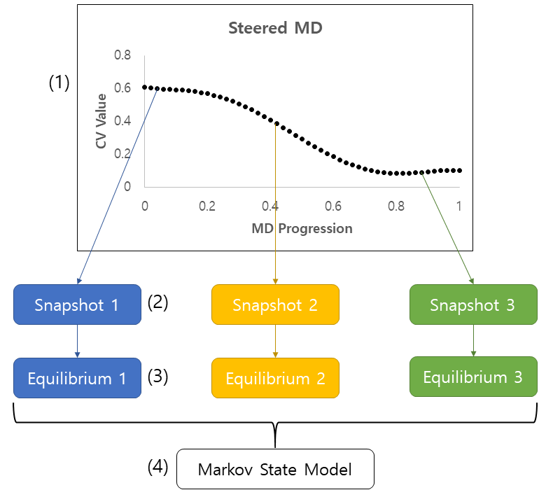
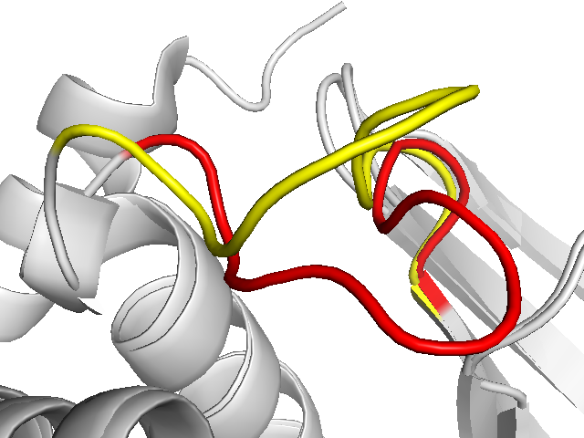

Author: Adele Hardie

Email: adele.hardie@ed.ac.uk

#### Requirements:
* BioSimSpace
* AMBER compiled with PLUMED
* An equilibrated starting system
* A target structure

## Introduction

Allosteric inhibition can be a useful alternative to conventional protein target-ing when the nature of the active site makes it difficult to design binders. This requires  assessment  of  whether  an  allosteric  binder  actually  has  an  effect  onprotein function, such as whether its presence shifts protein conformational ensemble to favour the inactive state. This can be modelled as a Markov chain by Markov State Models(MSMs).  Since the system is treated as memoryless, model building only requires local equilibrium. Therefore, it can make use of shorter MD simulations, allowing them to be run in parallel.

In order to have a more complete view of the protein ensemble, enhanced sampling methods are used, among them steered MD (sMD) (1). It introduces a bias potential that is added to the Hamiltonian, thus biasing the simulation towards a specified value of a chosen collective variable. Once the system has reached a certain conformation, those coordinates (2) can be used as starting points for equilibrium MD simulations (4) that can subsequently be used as data for constructing an MSM (4). An example summary of this is shown below:


PLUMED is a library that, among other things, has enhanced sampling algorithms. It works with multiple MD engines, including GROMACS and AMBER. PLUMED uses a [moving restraint](https://www.plumed.org/doc-v2.5/user-doc/html/_m_o_v_i_n_g_r_e_s_t_r_a_i_n_t.html) that is calculated as follows:

$V(\vec{s},t) = \frac{1}{2} \kappa(t) ( \vec{s} - \vec{s}_0(t) )^2$     (Eq. 1)

where $\vec{s}_0$ and $\kappa$ are time dependent and specified in the PLUMED input. $\vec{s}_0$ is the target CV value and $\kappa$ is the force constant in kJ mol$^{-1}$. The values of both of them are set at specific steps, and linearly interpolated in between.

This tutorial focuses on running the prerequisite simulations using BSS.The example system used is protein tyrosine phosphatase 1B(PTP1B), which exists in two dominant conformations: WPD loop open and WPD loop closed:



## Set up steered MD

Running steered MD in BioSimSpace is very similar to regular simulations already covered. It only requires some additional preparation for interfacing with PLUMED, the software that takes care of biasing the Hamiltonian.

#### Setting up the system

We start by importing the required libraries.

```python
import BioSimSpace as BSS
```

Load a system with BioSimSpace. This particular system is of PTP1B with the WPD loop open (from PDB entry 2HNP) with a peptide substrate and has been minimised and equilibrated.

```python
system = BSS.IO.readMolecules(['data/system.prm7', 'data/system.rst7'])
```

#### Creating the CV

A collective variable is required to run sMD, as this is the value that will be used to calculate the biasing potential. In this case, the CV is RMSD of the heavy atoms in the WPD loop (residues 178-184) when the WPD loop is closed (i.e. steering the loop from open to closed conformation). Let's load this reference structure.

```python
reference = BSS.IO.readMolecules('data/reference.pdb').getMolecule(0)
```

Since not all of the atoms in the reference will be used to calculate the RMSD, we check all the residues and append the appropriate atom indices to the `rmsd_indices` list. Here we check all the residues instead of directly accessing the residue list in case there are some residues missing in the structure.

```python
rmsd_indices = []
for residue in reference.getResidues():
    if 178<=residue.index()<=184:
        for atom in residue.getAtoms():
            if atom.element()!='Hydrogen (H, 1)':
                rmsd_indices.append(atom.index())
```

Once we have our system and reference, and we know which atoms will be used for the RMSD calculation, we can create a `CollectiveVariable` object.

```python
rmsd_cv = BSS.Metadynamics.CollectiveVariable.RMSD(system, reference, 0, rmsd_indices)
```

One thing to note when dealing with RMSD between two different structures, is that the atoms may not be in the same order. For example, atom 1 in `system` in this case is a hydrogen, whereas in `reference` it is an oxygen. BioSimSpace takes care of this by matching up the atoms in the system to the atoms in the reference. 

The requirements for the reference structure are that all atoms found in `reference.pdb` must also exist in `system`. They are matched by residue number and atom name. For example, if the reference structure has an atom named CA in residue 1, there must be an equivalent in the system, and they will be mapped together.

#### Setting up a steered MD protocol

To create a protocol, we need to set up the steering restraints and schedule. As shown in equation 1, steered MD is defined by the expected CV value and the force constant $\kappa$ at some time *t*. Generally sMD has four stages:

| Stage          | Expected end CV | Force constant  |
| -------------- | --------------- | --------------- |
| 1. start       | initial value   | none            |
| 2. apply force | initial value   | specified force |
| 3. steering    | target value    | specified force |
| 4. relaxation  | target value    | none            |

Force is usually applied over a few picoseconds, and the bulk of the simulation is used for steering, i.e. stage 3. We need to specify the end times for these stages:

```python
start = 0* BSS.Units.Time.nanosecond
apply_force = 4 * BSS.Units.Time.picosecond
steer = 150 * BSS.Units.Time.nanosecond
relax = 152 * BSS.Units.Time.nanosecond
```

The length of the steering step is the most important here and will depend on the system, the steering force constant, and the magnitude of the change sMD is supposed to accomplish.

Then the restraints specify the expected end CV values and the force constant ($\\kappa$(t) and $\vec(s)_0$(t)) at each step created above.

```python
nm = BSS.Units.Length.nanometer
restraint_1 = BSS.Metadynamics.Restraint(rmsd_cv.getInitialValue(), 0)
restraint_2 = BSS.Metadynamics.Restraint(rmsd_cv.getInitialValue(), 3500)
restraint_3 = BSS.Metadynamics.Restraint(0*nm, 3500)
restraint_4 = BSS.Metadynamics.Restraint(0*nm, 0)
```

In this scenario, we will be using a 3500 $kJ mol^{-1}$ force constant and our target RMSD value is 0 (as close as possible to the target structure). These schedule steps and restraints are used to create a steering protocol.

```python
protocol = BSS.Protocol.Steering(rmsd_cv, [start, apply_force, steer, relax], [restraint_1, restraint_2, restraint_3, restraint_4], runtime=152*BSS.Units.Time.nanosecond)
```

#### A quick look at GROMACS

BioSimSpace only has native implementation for steered MD with GROMACS at the moment. Luckily it's quite easy 

o adjust the standard AMBER production process to do the same thing, but for now let's have a look at how sMD can be run with GROMACS.

We have previously created a protocol for sMD, so all that is needed is to plug it into a GROMACS process.

```python
process = BSS.Process.Gromacs(system, protocol)
```

Checking the command line arguments that will be used to run this simulation:

```python
process.getArgs()
OrderedDict([('mdrun', True), ('-v', True), deffnm', 'gromacs'), plumed', 'plumed.dat')])
```

The argument `-plumed plumed.dat` tells GROMACS to use PLUMED, looking at the `plumed.dat` file for instructions. This process can be run like any other process you have seen before. All the required files have been created in the `process.workDir()` by BioSimSpace.

#### Steered MD in AMBER

If we tried to create an AMBER process with a steering error, we would get an error:

```python
process = BSS.Process.Amber(system, protocol)
IncompatibleError: Unsupported protocol: 'Steering'
```

However, since all that is required for steered MD is to let AMBER know to use PLUMED and to put the appropriate files in the working directory, we can modify a standard production process to achieve the same result.

A small workaround to get the contents of the PLUMED input file:

```python
plumed = BSS.Process._plumed.Plumed('.')
conf, files = plumed.createConfig(system, protocol)
```

`conf` contains PLUMED input file as a list of strings. Now that we have that, we can create a new protocol that is supported by `BioSimSpace.Process.Amber` and use it.

```python
protocol = BSS.Protocol.Production(runtime=152*BSS.Units.Time.nanosecond)
process = BSS.Process.Amber(system, protocol, exe=f'{os.environ["AMBERHOME"]}/bin/pmemd.cuda')
```

Start by saving the required files in the working directory:

```python
plumed_file = open(f'{process.workDir()}/plumed.in', 'w')
plumed_file.writelines(map(lambda x: x + '\n', conf))
plumed_file.close()
ref_file = open(f'{process.workDir()}/reference.pdb', 'w')
ref_file.writelines(map(lambda x: x + '\n', rmsd_cv.getReferencePDB()))
ref_file.close()
```

At the moment, the process configuration does not point AMBER towards using PLUMED.

```python
process.getConfig()
['Production.',
 ' &cntrl',
 '  ig=-1,',
 '  ntx=1,',
 '  ntxo=1,',
 '  ntpr=100,',
 '  ntwr=100,',
 '  ntwx=100,',
 '  irest=0,',
 '  dt=0.002,',
 '  nstlim=76000000,',
 '  ntc=2,',
 '  ntf=2,',
 '  ntt=3,',
 '  gamma_ln=2,',
 '  cut=8.0,',
 '  tempi=300.00,',
 '  temp0=300.00,',
 '  ntp=1,',
 '  pres0=1.01325,',
 ' /']
```

This can easily be changed by adding `plumed=1` and `plumedfile="plumed.in"` to the list of configurations.

```python
process.setConfig(process.getConfig()[:-1]+['  plumed=1,', '  plumedfile="plumed.in",', ' /'])
```

Now the standard process will run a steered MD simulation.

**Note:** when BioSimSpace writes the new topology file for an AMBER process, some unidentified small change causes PTP1B to stat unfolding on the timescale of a few ns. This is circumvented by simply copying over the original topology (this should not be necessary for other systems).

```python
copyfile('data/system.prm7', f'{process.workDir()}/amber.prm7')
```

#### Running sMD

There are a few ways to run the simulation once it has been set up, which will depend on what is available to you.

To run locally with this setup, simply start the process:

```python
process.start()
```

This will start the simulation in the background. It is recommended to set your `CUDA_VISIBLE_DEVICES` environment variable to an available GPU before launching the notebook.

However, you may want to run this on a cluster rather than your own workstation. To use the same files that we set up just now, zip them up and copy them over. In python:

```python
process.workDir()
'/tmp/tmps7klsay_'
```

In your terminal:

```bash
zip amber_input.zip /tmp/tmps7klsay_/*
scp amber_input user@somer.cluster:/path/to/simulation/dir
```

Simply unzip this and submit a `pmemd.cuda` job on the cluster available to you. Since the PLUMED usage is in the `amber.cfg` file, no other steps are necessary.

Alternatively an [example script](01_run_sMD.py) is available. It will run the same set up steps as above on your cluster, as well as the actual sMD simulation and will copy the output files from `/tmp` to the local running directory. It requires a topology, equilibrated coordinate, and reference PDB files (same as this example).
