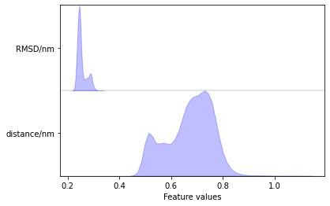
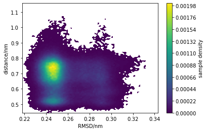

Author: Adele Hardie

Email: adele.hardie@ed.ac.uk

#### Requirements:
* pyemma
* mdtraj
* numpy
* A number of MD trajectories

## Markov State Models
Now that all of the required seeded MD simulations have run, we can use the trajectory data to construct a Markov State Model (MSM). [PyEMMA](http://emma-project.org/latest/) is a python library for this, and has their own [tutorials](http://emma-project.org/latest/tutorial.html). There is a lot to MSMs that could span a few workshops on its own. Here we illustrate how to load simulation data to then use for model building.

```python
import pyemma
import os
import mdtraj as md
import numpy as np
```

#### Get all trajectories
Loading all the trajectories would require more memory than available for most workstations. Instead we will ind all the trajectories that will be used and create a stream reader.
```python
source_dir = 'seeded_data'
files = []
for i in range(100):
    files.append(f'{source_dir}/snapshot_{i+1}/production_dry.nc')
```
Note that we are using dry trajectories here. In this case none of the features require water, and this makes data featurisation much faster (think 5k atoms vs. 40k atoms).

#### Featurize
MSMs do not use all atom coordinates, but requires dimensionality reduction. Here RMSD to open WPD loop conformation and distance between a catalytic residue and the substrate will be used. We create a featuriser object to do this.
```python
feat = pyemma.coordinates.featurizer('data/system_dry.prm7')
rmsd_reference = md.load('data/reference.pdb')
indices = []
for atom in rmsd_reference.top.atoms:
    if not atom.name.startswith('H') and 178<=atom.residue.index<=184:
        indices.append(atom.index)
feat.add_minrmsd_to_ref(rmsd_reference, atom_indices=indices)
substrate_distance = feat.pairs(feat.select('(resid 215 and name SG) or (resname PTR and name P)'))
feat.add_distances(substrate_distance)
```

#### Load data
Then we create our trajectory reader and get the reduced data, which is the values of RMSD and distance for each frame of each simulation.
```python
trajectories = pyemma.coordinates.source(files, feat)
data = trajectories.get_output()
data
[array([[0.2617052 , 0.50614816],
        [0.2521226 , 0.51235414],
        [0.263818  , 0.49899533],
        ...,
        [0.2941338 , 0.5791968 ],
        [0.3001721 , 0.6085965 ],
        [0.28907034, 0.5828696 ]], dtype=float32),
 array([[0.24496937, 0.5179444 ],
        [0.23971172, 0.5155687 ],
        [0.24117406, 0.5280065 ],
        ...,
        [0.24857913, 0.7953518 ],
        [0.23537804, 0.74935496],
        [0.24255018, 0.7605438 ]], dtype=float32),
        ...]
```
`data` is a list of numpy arrays, each corresponding to a seeded MD trajectory.

#### Plot data
pyemma has some plotting options for data visualization.
```python
pyemma.plots.plot_feature_histograms(np.vstack(data), feature_labels=['RMSD/nm', 'distance/nm'])
```



```python
fig, ax, misc = pyemma.plots.plot_density(np.vstack(data)[:,0], np.vstack(data)[:,1])
ax.set_xlabel('RMSD/nm')
ax.set_ylabel('distance/nm')
```


At this point our steered MD simulation has been used to sample a wide range of conformational space. The trajectory data from seeded MD runs has been reduced to important features only and is ready to be used in building an MSM.
