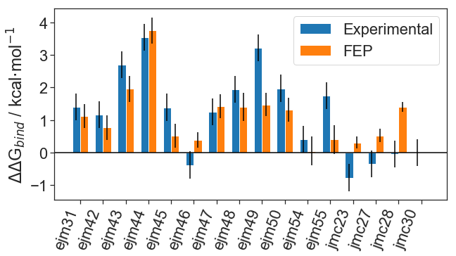

# 3. Analysing a Free Energy Perturbation calculation on a congeneric series of ligands

#### 3.1. Importing libraries and data files

Now that we have used our GPU hardware to run our FEP simulations, we can start analysing our results. For this we will use [FreeEnergyNetworkAnalysis](https://github.com/michellab/freenrgworkflows) functionalities in python.

```python
import networkanalysis.networkanalysis as n_graph
import networkanalysis.plotting as n_plot
import networkanalysis.experiments as n_ex
import networkanalysis.stats as n_stats
import networkanalysis
```

Additionally, we will use [matplotlib](https://matplotlib.org/), the main plotting library for python.

```python
import matplotlib.pyplot as plt
```

Finally, we will use [pandas](https://pandas.pydata.org/), a very helpful data analysis library for python that will help us work with our data more intuitively (instead of lists of numbers, using pandas we can work with a more table-like format).

```python
import pandas as pd
```

Now that we have the required modules, we can start our work by setting paths to our input files. On our computing cluster, BioSimSpace has appended FEP results to a .csv file that we can load with ```FreeEnergyNetworkAnalysis```. Additionally, we would like to compare our FEP predictions to experimental measures to see how reliable our predictions are. 

```python
# a CSV file output by SOMD that contains perturbation name,free energy,confidence.
results_filepath = './outputs/summary.csv'

# experimental values (e.g. ic50/ki) for all ligands in our set.
exp_filepath = './inputs/exp_data_tyk2.dat'
```

*Note that in advanced stages of lead optimisation FEP runs will consist mostly of 'new' ligands, for which no experimental data is abailable. In that situation we can omit supplying FreeEnergyNetworkAnalysis with experimental data, and all we will end up with is the free energy prediction per ligand.*

#### 3.2. Loading files into FreeEnergyNetworkAnalysis

We will use ```FreeEnergyNetworkAnalysis``` to analyse our predictions. Instead of just computing ΔΔG values for each transformation, we would like to estimate the ΔΔG value for each individual ligand. There are some rather involved algorithms needed for these steps which is what ```FreeEnergyNetworkAnalysis``` takes care of. 

```python
# Creating the perturbation network to do calculations on.
pG = n_graph.PerturbationGraph()

# Populate the network with our simulation results.
pG.populate_pert_graph(results_filepath)
```

*In case you have run replicates (which is recommended), you can add more results to the graph by using the function ```pG.add_data_to_graph('/path/to/additional/runs.csv')```*.

#### 3.3. Estimating Free Energies

Given our graph, we can now compute ΔΔG values predicted by FEP for each individual ligand. 

```python
####### REPLACE WITH WLS FUNCTION WHEN READY
pG.compute_weighted_avg_paths(target_compound)

# take the FEP predictions from the graph.
computed_relative_DDGs = pG.freeEnergyInKcal
```

Next, we want to have our experimental data in the same unit as our FEP predictions (kcal/mol), in the case of our TYK2 set the experimental data is in Ki. Again, ```FreeEnergyNetworkAnalysis``` can do this for us with only a few lines of code.

```python
experiments = n_ex.ExperimentalData()

####### REPLACE WITH WLS FUNCTION WHEN READY --> NO REF
experiments.compute_DDG_from_IC50s(exp_filepath, reference=target_compound)

experimental_DDGs = experiments.freeEnergiesInKcal
```


Now that we have both our binding affinities estimated by FEP and corresponding experimental values, we can work towards plotting our results. First, we will transform our data into a so-called ```pandas DataFrame```, which is an intuitive way of viewing data. 

```python
freenrg_dict = {}

# construct dict with experimental freenrg and error.
for item in experimental_DDGs:
    ligand = list(item.keys())[0]
    freenrg = list(item.values())[0]
    error = list(item.values())[1]
    freenrg_dict[ligand] = [freenrg, error]

# append computed freenrg and error.
for item in computed_relative_DDGs:
    ligand = list(item.keys())[0]
    freenrg = list(item.values())[0]
    error = list(item.values())[1]
    freenrg_dict[ligand].append(freenrg)
    freenrg_dict[ligand].append(error)

# from the newly structured dictionary, generate a pandas dataframe.
freenrg_df = pd.DataFrame(freenrg_dict, index=["freenrg_exp", "err_exp", "freenrg_fep", "err_fep"]).transpose()

# save our results to a file that can be opened in e.g. Excel.
freenrg_df.to_csv("outputs/fep_results_table.csv")
```

If we want to view our results we can call ```print(freenrg_df)```, which will output the following table:

*Table 1: table view of estimated free energies of binding versus experimental (all values in kcal/mol).*


Although informative, viewing these results in a table is not very intuitive. Next, we will generate some plots common in FEP studies.

#### 3.4. Generating plots

```Matplotlib``` is a very popular plotting library in python. Although it takes a bit of time to learn the basics, the library offers great flexibility in plotting any kind of data when compared to e.g. MS Excel. 

First, we will generate a barplot of our predictions, complete with error bars and plot formatting.

```python
# initiate an empty figure with fixed dimensions.
fig, ax = plt.subplots(figsize=(10,5))

# determine positions for X axis labels.
x_locs = np.arange(len(freenrg_df))

# set bar width
width = 0.35  

# plot both our experimental and FEP free energies using an offset on the x position so bars don't overlap.
ax.bar(x_locs - width/2, height=freenrg_df["freenrg_exp"], width=width, yerr=freenrg_df["err_exp"],
                label='Experimental')
ax.bar(x_locs + width/2, height=freenrg_df["freenrg_fep"], width=width, yerr=freenrg_df["err_fep"],
                label='FEP')
 
# format the plot further.
plt.axhline(color="black")
plt.ylabel("$\Delta\Delta$G$_{bind}$ / kcal$\cdot$mol$^{-1}$")
plt.xticks(x_locs, freenrg_df.index, rotation=70, ha="right")
plt.legend()

plt.savefig("outputs/fep_vs_exp_barplot.png", dpi=300)
```

The plot will now be saved as a high-resolution image in ```./outputs/``` and will look like this:



*Figure 1: barplot of free energies of binding predicted by FEP (orange) versus experimental (blue). All values depicted are in kcal/mol.*

############## REPLACE FIG WITH WLS FIG

Another common way of depicting FEP predictions is with scatterplots. FEP scatterplots are often annotated with 1- and 2 kcal/mol confidence regions to indicate regions in which a FEP prediction is deemed highly accurate (inner band) and reasonably accurate (outer band).

```python
plt.figure(figsize=(10,10))

plt.scatter(freenrg_df["freenrg_exp"], freenrg_df["freenrg_fep"], zorder=10)

# plot 1/2 kcal bounds:
plt.fill_between(
				x=[-15, 15], 
				y2=[-14.75,15.25],
				y1=[-15.25, 14.75],
				lw=0, 
				zorder=-10,
				alpha=0.3,
				color="grey")
# upper bound:
plt.fill_between(
				x=[-15, 15], 
				y2=[-14.5, 15.5],
				y1=[-14.75, 15.25],
				lw=0, 
				zorder=-10,
				color="grey", 
				alpha=0.2)
# lower bound:
plt.fill_between(
				x=[-15, 15], 
				y2=[-15.5,14.5],
				y1=[-14.75, 15.25],
				lw=0, 
				zorder=-10,
				color="grey", 
				alpha=0.2)

# plot error bars:
yerr = freenrg_df["err_fep"]
xerr = freenrg_df["err_exp"]

plt.errorbar(freenrg_df["freenrg_exp"], freenrg_df["freenrg_fep"], 
            yerr=yerr,
            xerr=xerr,   # comment this line to hide experimental error bars \
                         # as this can sometimes overcrowd the plot.
            ls="none",
            lw=0.5, 
            capsize=2,
            color="black",
            zorder=5
            )

# format the plot further.
plt.axhline(color="black", zorder=1)
plt.axvline(color="black", zorder=1)
plt.ylabel("Predicted $\Delta\Delta$G$_{bind}$ / kcal$\cdot$mol$^{-1}$")
plt.xlabel("Experimental $\Delta\Delta$G$_{bind}$ / kcal$\cdot$mol$^{-1}$")

# get the bounds. This can be done with min/max or simply by hand.
all_freenrg_values = np.concatenate([freenrg_df["freenrg_exp"].values,freenrg_df["freenrg_fep"].values])
min_lim = min(all_freenrg_values)
max_lim = max(all_freenrg_values)

# for a scatterplot we want the axis ranges to be the same. 
plt.xlim(min_lim*1.3, max_lim*1.3)
plt.ylim(min_lim*1.3, max_lim*1.3)

plt.savefig("outputs/fep_vs_exp_scatterplot.png", dpi=300)
```

The plot will now be saved as a high-resolution image in ```./outputs/``` and will look like this:


*Figure 2:  scatterplot of free energies of binding predicted by FEP (y axis) versus experimental (x axis). All values depicted are in kcal/mol. Depicted confidence bounds are of 1 kcal/mol (dark grey) and 2 kcal/mol (light grey).*

############## REPLACE FIG WITH WLS FIG

#### Final remarks

There are several other things we might do with ```FreeEnergyNetworkAnalysis```. 

For instance, in advanced stages of lead optimisation we might be working with a ligand (for which we have experimental affinity) and a series of new ligands (for which we have none). In such a case, it makes sense to use that ligand as a reference. This can be done simply by replacing the above code with 

```python
# Add a reference compound if needed. 
target_compound = 'ejm48'
pG.compute_weighted_avg_paths(target_compound)

computed_relative_DDGs = pG.freeEnergyInKcal

pG.write_free_energies(computed_relative_DDGs)
```

Sometimes, when working with ligand series that contain very dissimilar ligands, it is necessary to include one or more *intermediate* ligands. The purpose of these is to create more reliable transformations (at the cost of doing extra simulations). For analysis these can be discarded, as we are not necessarily interested in their binding affinity to the protein target. These can be excluded from the analysis graph by running:

```python
pG.format_free_energies(intermed_ID="name_of_intermediate")
```

*this should be run after computing free energies and before writing free energies, such that the intermediate energy is excluded.*

