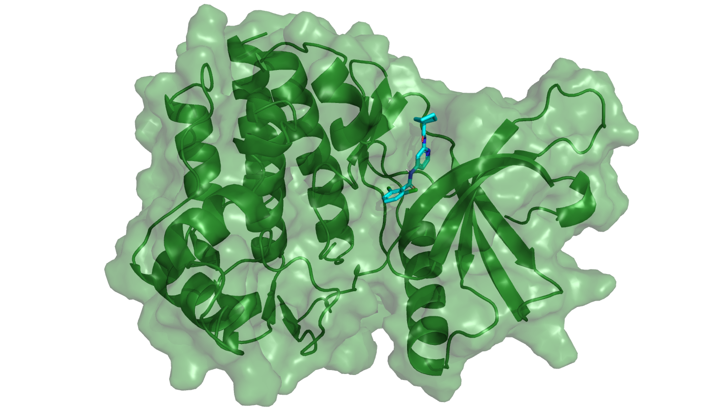
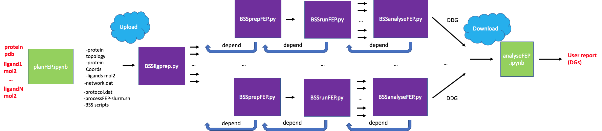
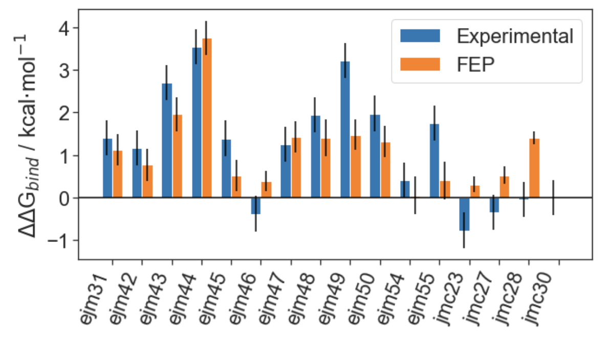

# Free Energy Perturbation using BioSimSpace

Authors:

- Jenke Scheen - j.scheen@sms.ed.ac.uk
- Julien Michel

## Introduction

Computational chemists can support structure-activity relationship studies in medicinal chemistry by making computer models that can predict binding affinity of ligands to proteins. One of the most popular techniques for this is Free Energy Perturbation (FEP), which relies on simulation alchemical transformations of ligands in a congeneric series, simulating them both in a protein target and in just a waterbox. Relative free energies of binding (ΔΔG in kcal/mol) can then be computed by simply subtracting the ΔG (in protein) and the ΔG (in water). Some introductory reading:

[Best Practices for Alchemical Free Energy Calculations](https://www.livecomsjournal.org/article/18378-best-practices-for-alchemical-free-energy-calculations-article-v1-0) 

[Relative Binding Free Energy Calculations in Drug Discovery: Recent Advances and Practical Considerations](https://pubs.acs.org/doi/10.1021/acs.jcim.7b00564)

[Assessment of Binding Affinity via Alchemical Free-Energy Calculations](https://pubs.acs.org/doi/10.1021/acs.jcim.0c00165)

This documentation will outline the steps needed to:

- Select a series of transformations to simulate using LOMAP
- Use BioSimSpace to set up files needed for a standard FEP run in both SOMD and GROMACS
- Run FEP using BioSimSpace on a computing cluster
- Analyse FEP simulation results
- Compile all FEP results locally and perform data analyses

For this tutorial we will be using TYK2, a common benchmarking set in the FEP field, first used by Schrödinger in their [2015 FEP+ paper](https://pubs.acs.org/doi/abs/10.1021/ja512751q).



​															*Figure 1: Tyrosine kinase 2 (TYK2) structure with bound ligand (ejm_48).*

Typically in FEP the goal is to predict free energies of binding for a collection of ligands (normally 10-20). Although methods exist (such as absolute FEP) that can predict these energies directly (i.e. ΔGbind), these are often complicated and computationally expensive. (relative) FEP uses a basic rule in thermodynamics that dictates that, given a thermodynamic cycle, the net energy must always be 0. FEP allows users to compute the ΔΔG of binding between two ligands through this mechanism (see figure 2).


*Figure 2: Thermodynamic cycle that allows FEP practicioners to compute relative energies of binding. Because the difference between the vertical legs equals the difference between the horizontal legs, we can circumvent predicting dGbind directly, but instead compute ddGbind by transforming between two ligands in both the solvated and bound phase.*

Because we calculate *relative* energies, we therefore have to transform the between pairs of ligands in both the fee and bound phase (hence the name free energy *perturbation*. Typically, smaller (i.e. fewer heavy atoms) transformations are more reliable which means that for a ligand series we want to selectively make combinations of ligands to cover the whole series. In FEP, we do this using *perturbation networks*, typically generated by FEP softwares. Although generate these networks can be done by hand, it is typically better to do it programmatically to save time and create better networks (transformation reliability does not depend just on transformation size, but also a series of other unfavourable moiety transformations).

## Setting up a FEP calculation using BioSimSpace

BioSimSpace allows users to set up and run a FEP calculation in just a few lines of code (and input files). First, we import BioSimSpace and our input files:

``` python
import BioSimSpace as BSS
ligand_1 = BSS.IO.readMolecules("ligand_1.mol2")[0]
ligand_2 = BSS.IO.readMolecules("ligand_2.mol2")[0]
protein = BSS.IO.readMolecules("protein.*")[0]
```

Parameterise our input molecules:

```python
ligand_1 = BSS.Parameters.gaff2(ligand_1).getMolecule()
ligand_2 = BSS.Parameters.gaff2(ligand_2).getMolecule()
protein = BSS.Parameters.ff14sb(protein).getMolecule()
```

Because we are transforming one ligand to the other, we need them to be well aligned. This can simply be done by:

```python
atom_mapping = BSS.Align.matchAtoms(ligand_1, ligand_2)
ligand_1 = BSS.Align.rmsdAlign(ligand_1, ligand_2, atom_mapping)
```

Now we have to create a 'merged' molecule, i.e. a molecule that we can transform in a way such that the endpoints are both input ligands:

```python
merged = BSS.Align.merge(ligand_1, ligand_2)
```

Next, we can add this merged structure into our protein by addition:

```python
system = merged + protein
```

Then, we put a water box around the system.

```python
system_solvated = BSS.Solvent.tip3p(molecule=system, box=3*[10*BSS.Units.Length.nanometer])
```

At which point we are ready to run FEP! We just have to set how we want to run FEP (here, just use the standard settings):

```
protocol = BSS.Protocol.FreeEnergy()
```

And then we can let BioSimSpace set up all necessary files for us by:

```python
freenrg = BSS.FreeEnergy.Binding(solvated, protocol, work_dir="output")
```

Running the FEP calculation is simply done running:

```python
freenrg.run()
```

This only makes sense on a workstation with GPUs or GPU cloud resources or a GPU cluster. Once the run has finished, we can analyse our FEP results with:

```python
freenrg.analyse()
```

## Workflow of a BioSimSpace FEP pipeline

Because a single FEP simulation typically takes 5-10 hours to run on a single GPU (depending on settings and hardware), FEP is usually run on a computing cluster (or HPC/ cloud service). This allows practicioners to run many simulations at the same time, turning an FEP campaign into a process that takes just several days (or even less) instead of weeks (or even more). 

Given a protein input file and a series of ligand input files, we will be using a Jupyter Notebook that uses LOMAP to generate a perturbation network for us. This notebook will also write all files necessary to further prepare our FEP simulations. Because preparing ligands and proteins for FEP can already require some heavy computation, this will be the first process that will run on a cluster. Then, after running and processing the FEP outputs, we can download the results back to our local workstation. There, the analysis notebook uses FreeEnergyAnalysis to process FEP predictions and generate plots.

*Figure 3: Schematic of the FEP pipeline in this report. Whereas blue boxes represent notebooks run on a local machine, orange boxes represent python scripts run sequentially on a computing cluster.*

# 1. Generating a perturbation network to run FEP on a congeneric series of ligands

For this step, open the jupyter notebook **setup_fep.ipynb**. If you would like to use your own ligands and protein, you can put these in ```inputs/ligands/``` and ```inputs/protein/```, respectively.

After running all the cells in this notebook, the folder ```./execution_model/``` will contain everything needed to run FEP in parallel on your cluster. To move this folder to your cluster, you can use for instance SCP:


*Note: on some system setups, no copying will be needed as your computing cluster might be on the same file system as your local workstation.*

# 2. Running FEP on a computing cluster using BioSimSpace

The folder ```./execution_model/``` contains several scripts and folders, of which the most important are:

- ```processFEP-slurm.sh``` and ```processFEP-lsf.sh```: running either of these scripts will submit all simulations (depending on the cluster setup). Note that there are several parameters at the top of these scripts that have to be set (by e.g. your system administrator) that will tell BioSimSpace of all relevant paths to software dependencies and other important things.
- ```./scripts/``` contains all necessary scripts to run FEP with BioSimSpace. Advanced users can tweak more settings in these.

If everything has been set up correctly, running:


will start the whole FEP job submission. First, all systems will be prepared, then run and then analysed (see figure 3). When all jobs are finished (or when the first perturbation has finished), FEP predictions will be written to ```./outputs/SOMD/summary.csv``` (in case of SOMD engine). Logfiles for seeing process outputs can be found in ```./logs/```. Additionally, perturbations that were simulated successfully will have an *overlap matrix* figure saved to ```./logs/```; these can be checked to see if convergence was reached per simulation leg (see [Best Practices for Alchemical Free Energy Calculations](https://www.livecomsjournal.org/article/18378-best-practices-for-alchemical-free-energy-calculations-article-v1-0) ).

For our final analysis, we will only need ```./outputs/SOMD/summary.csv```. Thus, we need to download this file back onto our local workstation. We can do this with SCP again, by running (from our workstation, i.e. not logged into the cluster):


# 3. Analysing FEP results 

For this step, open the jupyter notebook **analyse_fep.ipynb**. Running cells in this notebook will generate typical FEP figures (barplots and scatterplots); if you have missing or failed perturbations, the script should be able to work out an optimal prediction (although at some point with enough missing FEP predictions, ligands will of course be missing). If you happen to have experimental affinity values, you can validate how accurate your FEP predictions are.

An example result from this notebook is the classic barplot:



