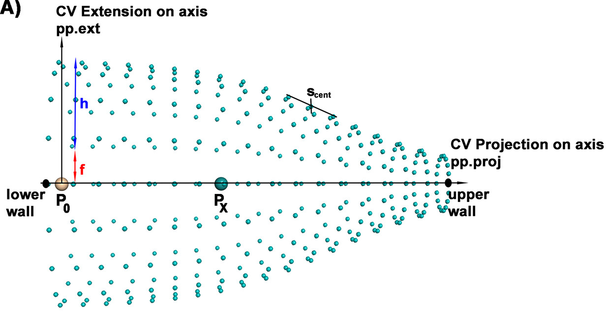

# Funnel Metadynamics tutorial

This tutorial aims to describe how to use scripts that help setup funnel metadynamics (fun-metaD) simulations. The main paper that describe what fun-metaD is [Limogelli *et al* 2013](https://www.pnas.org/content/110/16/6358), but in this tutorial I will describe  [Rhys *et al* 2020](https://www.ncbi.nlm.nih.gov/pmc/articles/PMC7467642/) and [Saleh *et al* 2017](https://pubs.acs.org/doi/10.1021/acs.jcim.6b00772) implementation. The main difference between the two implementations is the functional form of the funnel restraints: the original fun-metaD relied on a cone and a cylinder joined to make a funnel using a step function, while the new one uses a single sigmoid function. The Limogelli implementation also requires the protein to be realigned with a reference structure to keep the funnel strictly in place over the binding site, which hurts the performance. The implementation I will describe here allows the funnel to move with the protein.

One of the biggest drawbacks to using fun-metaD for large-scale absolute binding free energy (ABFE) calculations is the difficulty of setting up the simulations. Its hard to know where the funnel should be defined, how big it needs to be, what each of the sigmoid function parameters should be set to, along with the chore of writting PLUMED files, where each protein and ligand system will have sligthly different atom IDs.

The purpose of these scripts is to make this easier, allowing for a quicker setup and much faster automation of large ABFE screening campaigns. I've called the collection of these functions **'funnel_maker'**.

By the end of this tutorial you should know:
1. The basics of what fun-metaD does
2. How to visualise the suggested funnel restraints using PyMOL
3. How to setup PLUMED and OpenMM fun-metaD simulations

Let's get started.

## Part 1

Metadynamics is an enhanced sampling method that biases a simulation along a chosen set of reaction coordinates, or as the MetaD people call them, collective variables (CVs). This bias is deposited at defined time intervals and takes the shape of a Gaussian potential. Investigation of drug binding should involve at least one CV, distance from the drug molecule to the protein, where the distance between them can be biased causing the drug to unbind. However, that single distance is degenerate, meaning many different configurations of the drug in 3D space will not be described by that single distance. It also involves the exploration of a very large volume, hindering convergence. 

Fun-metaD gets around both of these problems, restricting the exploration by using funnel-shaped restraints and reducing degeneracy by using two CVs - 'projection' and 'extent'. See Figure A.

The restraints that limit in the pp.ext CV follow a sigmoid function:

\begin{equation*}
 S = h \Bigl(\frac{1}{1+e^{b(i-x)}}\Bigr) + f
\end{equation*}

where, S is the maximal distance from the axis, at pp.proj = i, h is the 'wall_width', f is the 'wall_buffer', b is the 'beta_cent' (the steepness at the inflection point), x is the 's_cent' (the inflection point as a value of pp.proj). The exploration along the pp.proj is limited by the 'lower_wall' and 'upper_wall' parameters. The funnel's radius at the narrow end is equal to 'wall_buffer'. 'P0' and 'Px' are the points that define the funnel's vector. From now on I'll refer to them as p1 and p2, respectively.

It should be obvious that there is still some degeneracy - in the plane perpendicular to the projection axis. However, this is good compromise between having sufficient accuracy for describing the binding of a ligand and the tolerable slowdown of using only two CVs.

"Where should the funnel point? How big should it be at the base? Do I need to change the position of the inflexion point? The steepness? How long should the funnel be?"

There aren't any perfect answers to any of these questions. 

Of course, the funnel needs to point out, with the narrow end in the solvent, away from any protein residues. 'Funnel_maker' addresses that question pretty well, most of the vectors it picks for defining the p1 and p2 points are good enough. Its still a good idea to check, by having a look with PyMOL; I will point out one edge case.

As for picking the parameters for the sigmoid - the funnel will need to be smaller than you think. There is usually only one binding site and the funnel should only enclose it, excluding other protein features, with a small 'wall_width'. This really helps with convergence by preventing the drug molecule from exploring irrelevant regions in the free energy surface (FES). Other parameters don't matter that much and the default numbers will suffice in most situations. 
